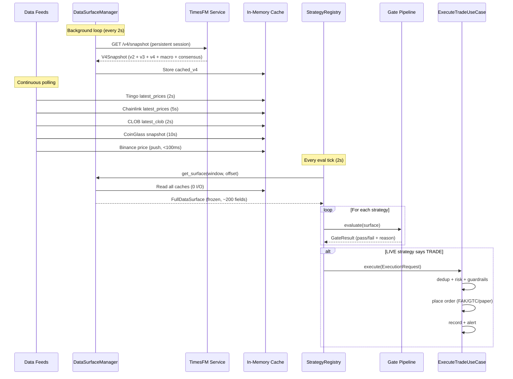
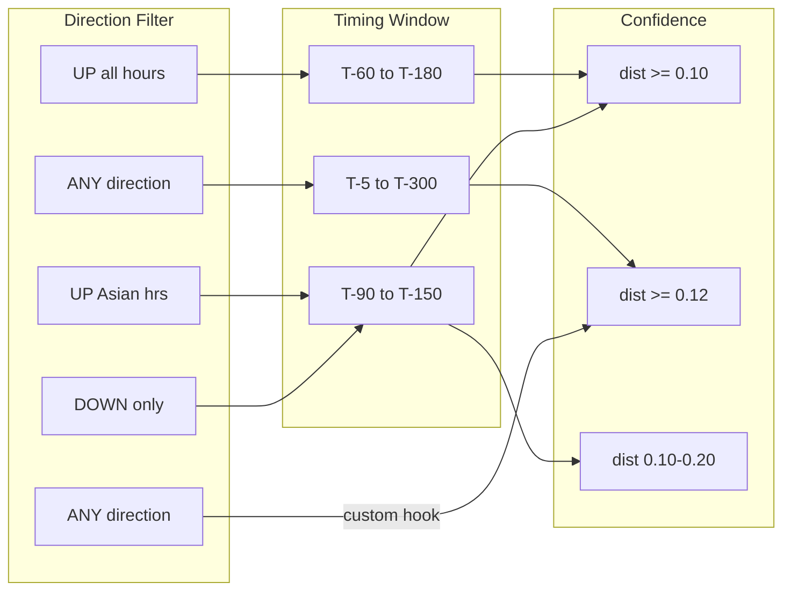
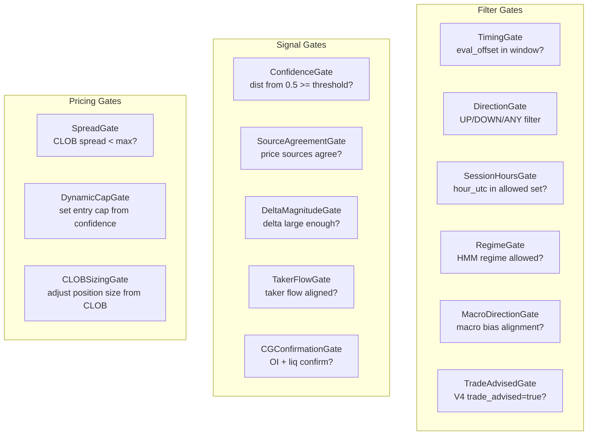
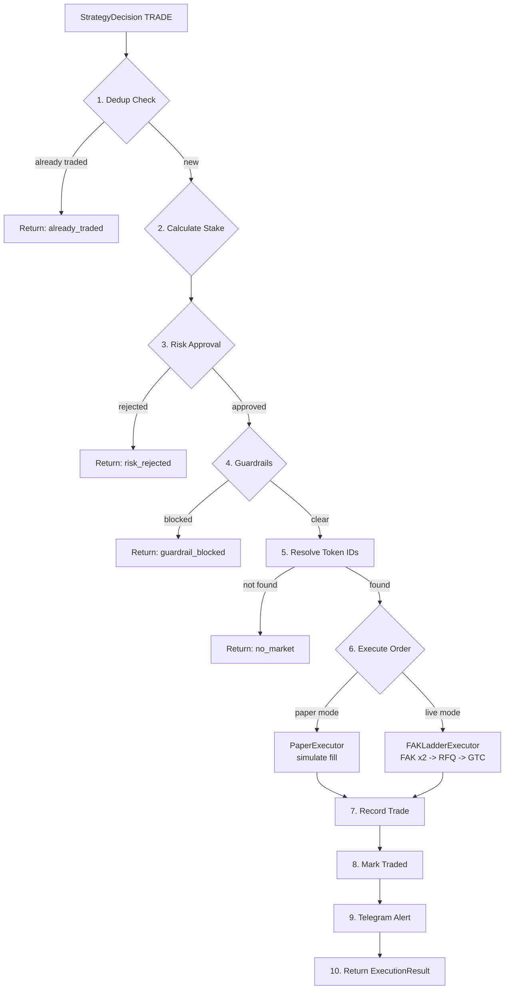
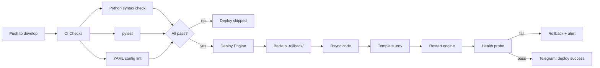

# Strategy Engine v2 — Architecture Reference

**Version:** 2.0.0 | **Date:** April 13, 2026 | **Author:** Billy Richards + Claude Opus 4.6  
**Status:** Live on Montreal (paper mode) | **Branch:** develop

---

## 1. System Architecture

```mermaid
graph TB
    subgraph "Data Ingestion (1-3 Hz)"
        BIN[Binance WS<br/>aggTrade push]
        TI[Tiingo REST<br/>2s poll]
        CL[Chainlink<br/>5s poll]
        CLOB[CLOB Feed<br/>2s poll]
        CG[CoinGlass<br/>10s poll]
        GAMMA[Gamma API<br/>per window]
    end

    subgraph "Data Surface Layer (CA-08)"
        DSM[DataSurfaceManager<br/>2s background pre-fetch]
        V4HTTP[V4 Snapshot HTTP<br/>persistent session]
        TSFM[TimesFM Service<br/>3.98.114.0:8080]
        FDS[FullDataSurface<br/>~200 frozen fields<br/>assembled < 1ms]
    end

    subgraph "Strategy Registry (CA-07)"
        REG[StrategyRegistry<br/>YAML config loader]
        subgraph "5 Strategies"
            S1[v4_down_only<br/>LIVE / DOWN / T90-150]
            S2[v4_up_basic<br/>GHOST / UP / T60-180]
            S3[v4_up_asian<br/>GHOST / UP / Asian hrs]
            S4[v4_fusion<br/>GHOST / ANY / custom]
            S5[v10_gate<br/>GHOST / ANY / 8 gates]
        end
    end

    subgraph "Gate Library (16 gates)"
        G1[TimingGate]
        G2[DirectionGate]
        G3[ConfidenceGate]
        G4[SessionHoursGate]
        G5[CLOBSizingGate]
        G6[SourceAgreementGate]
        G7[DeltaMagnitudeGate]
        G8[TakerFlowGate]
        G9[CGConfirmationGate]
        G10[SpreadGate]
        G11[DynamicCapGate]
        G12[RegimeGate]
        G13[MacroDirectionGate]
        G14[TradeAdvisedGate]
    end

    subgraph "Execution (SP-06)"
        EX[ExecuteTradeUseCase<br/>10-step clean flow]
        FAK[FAKLadderExecutor<br/>FAK x2 -> RFQ -> GTC]
        PAP[PaperExecutor<br/>simulated fills]
        REC[TradeRecorder<br/>DB + OrderManager]
        TG[Telegram Alerts<br/>per strategy name]
    end

    subgraph "Persistence"
        DB[(Railway PostgreSQL)]
        SD[strategy_decisions]
        TR[trades]
        WS[window_snapshots]
        SE[signal_evaluations]
    end

    BIN --> DSM
    TI --> DSM
    CL --> DSM
    CLOB --> DSM
    CG --> DSM
    GAMMA --> DSM
    DSM --> V4HTTP --> TSFM
    DSM --> FDS
    FDS --> REG
    REG --> S1 & S2 & S3 & S4 & S5
    S1 & S2 & S3 & S4 & S5 -.-> G1 & G2 & G3 & G4 & G5 & G6 & G7 & G8 & G9 & G10 & G11 & G12 & G13 & G14
    REG -->|LIVE TRADE| EX
    EX --> FAK & PAP
    EX --> REC --> DB
    EX --> TG
    REG -->|ALL decisions| SD
```



---

## 2. Data Surface — FullDataSurface

Every strategy evaluation receives a frozen `FullDataSurface` dataclass with ~200 fields. Assembled in <1ms from in-memory caches. Zero I/O at decision time.

### 2.1 Data Sources & Freshness

```mermaid
gantt
    title Data Freshness at Decision Time
    dateFormat X
    axisFormat %Lms
    
    section Price
    Binance WS (push)           :done, 0, 100
    
    section Deltas
    Delta Binance (computed)    :done, 0, 100
    Delta Tiingo (in-memory)    :active, 0, 2000
    Delta Chainlink (in-memory) :active, 0, 5000
    
    section Market
    VPIN + Regime (in-memory)   :done, 0, 1000
    CLOB bid/ask (in-memory)    :active, 0, 2000
    CoinGlass (in-memory)       :crit, 0, 10000
    
    section Predictions
    V4 Snapshot (2s cache)      :active, 0, 2000
    V2 probability_up           :active, 0, 2000
    V3 composites (9 timescales):active, 0, 5000
    
    section Macro
    Macro bias (60s TTL)        :crit, 0, 60000
```



### 2.2 Field Categories

| Category | Fields | Source | Update Rate |
|---|---|---|---|
| **Price** | `current_price`, `open_price` | Binance WS | <100ms |
| **Deltas** | `delta_binance`, `delta_tiingo`, `delta_chainlink`, `delta_pct`, `delta_source` | Feeds in-memory | 2-5s |
| **VPIN** | `vpin`, `regime` | VPINCalculator | <1s |
| **V2 Predictions** | `v2_probability_up`, `v2_probability_raw`, `v2_quantiles_p10/p50/p90` | V4 snapshot cache | 2s |
| **V3 Multi-Horizon** | `v3_5m/15m/1h/4h/24h/48h/72h/1w/2w_composite` | V4 snapshot cache | 2s |
| **V3 Sub-Signals** | `v3_sub_elm/cascade/taker/oi/funding/vpin/momentum` | V4 snapshot cache | 2s |
| **V4 Regime** | `v4_regime`, `v4_regime_confidence`, `v4_regime_persistence` | V4 snapshot cache | 2s |
| **V4 Macro** | `v4_macro_bias`, `v4_macro_direction_gate`, `v4_macro_size_modifier` | V4 snapshot (60s TTL) | 60s |
| **V4 Consensus** | `v4_consensus_safe_to_trade`, `v4_consensus_agreement_score` | V4 snapshot cache | 2s |
| **V4 Conviction** | `v4_conviction`, `v4_conviction_score` | V4 snapshot cache | 2s |
| **Polymarket Outcome** | `poly_direction`, `poly_trade_advised`, `poly_confidence`, `poly_confidence_distance`, `poly_timing`, `poly_max_entry_price` | V4 snapshot cache | 2s |
| **CLOB** | `clob_up_bid/ask`, `clob_down_bid/ask`, `clob_implied_up` | CLOBFeed in-memory | 2s |
| **Gamma** | `gamma_up_price`, `gamma_down_price` | Per window | 5m |
| **CoinGlass** | `cg_oi_usd`, `cg_funding_rate`, `cg_taker_buy/sell_vol`, `cg_liq_total/long/short`, `cg_long_short_ratio` | CG Enhanced in-memory | 10s |
| **TimesFM** | `timesfm_expected_move_bps`, `timesfm_vol_forecast_bps` | V4 snapshot cache | 2s |
| **Window** | `hour_utc`, `seconds_to_close`, `eval_offset` | Computed | Per eval |

### 2.3 Data Flow



---

## 3. Strategy Configurations

### 3.1 Strategy Overview



### 3.2 v4_down_only (LIVE) — 90.3% WR

```yaml
name: v4_down_only
version: "2.0.0"
mode: LIVE
asset: BTC
timescale: 5m

gates:
  - timing:      { min_offset: 90, max_offset: 150 }
  - direction:   { direction: DOWN }
  - confidence:  { min_dist: 0.10 }
  - trade_advised: {}
  - clob_sizing: { schedule: [0.55→2.0x, 0.35→1.2x, 0.25→1.0x, 0.0→SKIP], null: 1.5x }

sizing: { type: custom, fraction: 0.025, max: 0.10, hook: clob_sizing }
```

**Data-driven from 897K-sample analysis (2026-04-12):**
- DOWN predictions: 76-99% WR across all CLOB bands
- UP predictions: 1.5-53% WR → always skip
- T-90 to T-150 has 90.3% WR; outside this band accuracy degrades to ~50-65%

**CLOB sizing schedule:**

| CLOB Down Ask | Size Modifier | WR | Meaning |
|---|---|---|---|
| >= $0.55 | 2.0x | 97%+ | Model + market strongly agree DOWN |
| $0.35-$0.55 | 1.2x | 88-93% | Mild agreement |
| $0.25-$0.35 | 1.0x | 87% | Base Kelly (contrarian) |
| < $0.25 | **SKIP** | 53% | Not tradeable |
| NULL | 1.5x | 99% | Strong moves lack CLOB data |

### 3.3 v4_up_basic (GHOST) — Expected 70-80% WR

```yaml
name: v4_up_basic
version: "1.0.0"
mode: GHOST
asset: BTC
timescale: 5m

gates:
  - timing:      { min_offset: 60, max_offset: 180 }
  - direction:   { direction: UP }
  - confidence:  { min_dist: 0.10 }

sizing: { type: fixed_kelly, fraction: 0.025, max: 0.05 }
```

**Replaces broken v4_up_asian (0 trades from 19,490 decisions):**
- Wider timing window (T-60-180 vs T-90-150)
- All hours (not just Asian session)
- Same confidence threshold (dist >= 0.10)
- Expected 5-15 trades/day

### 3.4 v4_up_asian (GHOST) — Asian Session Edge

```yaml
name: v4_up_asian
version: "2.0.0"
mode: GHOST
asset: BTC
timescale: 5m

gates:
  - timing:        { min_offset: 90, max_offset: 150 }
  - direction:     { direction: UP }
  - confidence:    { min_dist: 0.10, max_dist: 0.20 }
  - session_hours: { hours_utc: [23, 0, 1, 2] }

sizing: { type: fixed_kelly, fraction: 0.025, max: 0.05 }
```

**Why Asian session:** Lower liquidity, dominated by Asian retail accumulation. Medium conviction band (0.10-0.20) filters weak signals while avoiding over-confident ones priced in by CLOB.

### 3.5 v4_fusion (GHOST) — Complex Polymarket Evaluation

```yaml
name: v4_fusion
version: "4.1.0"
mode: GHOST
asset: BTC
timescale: 5m

gates: []  # All logic in custom hook
hooks_file: v4_fusion.py
pre_gate_hook: evaluate_polymarket_v2

sizing: { type: fixed_kelly, fraction: 0.025, max: 0.10 }
```

**Three evaluation paths (in priority order):**
1. **Polymarket V2**: reads `polymarket_live_recommended_outcome` from V4 snapshot — timing gate (early/optimal/late_window/expired), confidence distance >= 0.12, CLOB divergence for late_window, macro direction gate
2. **Polymarket V1**: legacy fallback for old timesfm builds
3. **Legacy**: conviction tier thresholds, regime gating, consensus

### 3.6 v10_gate (GHOST) — Full 8-Gate Pipeline

```yaml
name: v10_gate
version: "10.6.0"
mode: GHOST
asset: BTC
timescale: 5m

gates:
  - timing:            { min_offset: 5, max_offset: 300 }
  - source_agreement:  { min_sources: 2, spot_only: false }
  - delta_magnitude:   { min_threshold: 0.0005 }
  - taker_flow:        {}
  - cg_confirmation:   { oi_threshold: 0.01, liq_threshold: 1000000 }
  - confidence:        { min_dist: 0.12 }
  - spread:            { max_spread_bps: 100 }
  - dynamic_cap:       { default_cap: 0.65 }

hooks_file: v10_gate.py
post_gate_hook: classify_confidence

sizing: { type: fixed_kelly, fraction: 0.025, max: 0.10 }
```

---

## 4. Gate Library Reference

All gates are **pure Python** — zero external dependencies. Each takes `FullDataSurface` and returns `GateResult(passed, gate_name, reason, data)`.



| Gate | Parameters | Reads From Surface | Pass Condition |
|---|---|---|---|
| `TimingGate` | `min_offset`, `max_offset` | `eval_offset` | `min <= offset <= max` |
| `DirectionGate` | `direction` (UP/DOWN/ANY) | `poly_direction`, `v2_probability_up` | Direction matches config |
| `ConfidenceGate` | `min_dist`, `max_dist?` | `poly_confidence_distance`, `v2_probability_up` | `min <= dist <= max` |
| `SessionHoursGate` | `hours_utc` | `hour_utc` | Hour in allowed set |
| `CLOBSizingGate` | `schedule`, `null_modifier` | `clob_down_ask` or `clob_up_ask` | Sets `size_modifier` in result.data |
| `SourceAgreementGate` | `min_sources`, `spot_only` | `delta_tiingo`, `delta_chainlink`, `delta_binance` | >= min sources with same sign |
| `DeltaMagnitudeGate` | `min_threshold` | `delta_pct` | `abs(delta) >= threshold` |
| `TakerFlowGate` | — | `cg_taker_buy_vol`, `cg_taker_sell_vol` | Flow aligns with direction |
| `CGConfirmationGate` | `oi_threshold`, `liq_threshold` | `cg_oi_usd`, `cg_liq_total` | OI or liquidations confirm |
| `SpreadGate` | `max_spread_bps` | `clob_up_bid/ask`, `clob_down_bid/ask` | Spread < max |
| `DynamicCapGate` | `default_cap` | `poly_confidence_distance` | Always passes, sets `entry_cap` |
| `RegimeGate` | `allowed_regimes` | `v4_regime` | Regime in allowed set |
| `MacroDirectionGate` | — | `v4_macro_direction_gate`, direction | ALLOW_ALL or aligned |
| `TradeAdvisedGate` | — | `poly_trade_advised` | `trade_advised == True` |

---

## 5. Evaluation Frequency & Signal Coverage

### 5.1 Eval Tick Rate

```
Window duration:    300s (5 minutes)
Eval interval:      2s (FIVE_MIN_EVAL_INTERVAL=2)
Eval offsets:       91 ticks per window (T-240 to T-60)
Strategies:         5 (all evaluate every tick)
Total evaluations:  455 per window (91 ticks x 5 strategies)
```

### 5.2 Per-Window Timeline

```mermaid
gantt
    title 5-Minute Window Evaluation Timeline
    dateFormat X
    axisFormat T-%Ss
    
    section Window
    ACTIVE (T-300 to T-0)       :active, 0, 300
    
    section v10_gate
    Evaluating (T-300 to T-5)   :crit, 0, 295
    
    section v4_up_basic  
    Evaluating (T-180 to T-60)  :active, 120, 240
    
    section v4_down_only
    Evaluating (T-150 to T-90)  :done, 150, 210
    
    section v4_up_asian
    Evaluating (T-150 to T-90)  :done, 150, 210
    
    section v4_fusion
    Evaluating (depends on timing field) :active, 120, 270
```



### 5.3 Signal Evaluation Data Persistence

Every evaluation (TRADE + SKIP) for all 5 strategies writes to `strategy_decisions` table:

```sql
-- Query: recent strategy decisions
SELECT strategy_id, action, direction, skip_reason, 
       confidence_score, eval_offset, evaluated_at
FROM strategy_decisions
WHERE window_ts = 1776103500
ORDER BY evaluated_at DESC
LIMIT 20;
```

**Metadata JSON** (stored per decision) contains:
- Gate results: `[{gate: "timing", passed: true, reason: "..."}, ...]`
- Sizing: `{fraction, modifier, label, entry_cap}`
- Context: `{poly_direction, poly_confidence_distance, v2_probability_up}`

---

## 6. Execution Path

### 6.1 ExecuteTradeUseCase — 10-Step Flow



### 6.2 Order Types

| Type | Behavior | When Used |
|---|---|---|
| **FAK** (Fill-and-Kill) | Match at price or better, cancel remainder | First attempt — aggressive entry |
| **GTC** (Good-Til-Cancelled) | Rest on book until filled or expired | Fallback when FAK exhausts |
| **FOK** (Fill-or-Kill) | All or nothing — fill entirely or cancel | Future use for exact-size orders |
| **Paper** | Simulate fill at cap +/- 0.5% slippage | Paper trading mode |

### 6.3 Feature Flags

| Flag | Default | Effect |
|---|---|---|
| `ENGINE_USE_STRATEGY_REGISTRY` | `false` | Enable v2 registry (evaluations) |
| `ENGINE_REGISTRY_EXECUTE` | `false` | Enable v2 execution (LIVE trades) |
| `ENGINE_USE_STRATEGY_PORT` | `false` | Old multi-strategy system |
| `FIVE_MIN_ENABLED` | `false` | Polymarket 5-min feed |
| `V4_FUSION_ENABLED` | `false` | V4 snapshot fetching |
| `PAPER_MODE` | `true` | Paper vs live trading |

---

## 7. File Structure

```
engine/
├── strategies/
│   ├── data_surface.py           # FullDataSurface + DataSurfaceManager
│   ├── registry.py               # StrategyRegistry — loads YAML, evaluates
│   ├── gates/
│   │   ├── base.py               # Gate ABC + GateResult
│   │   ├── timing.py             # TimingGate
│   │   ├── direction.py          # DirectionGate
│   │   ├── confidence.py         # ConfidenceGate
│   │   ├── session_hours.py      # SessionHoursGate
│   │   ├── clob_sizing.py        # CLOBSizingGate
│   │   ├── source_agreement.py   # SourceAgreementGate
│   │   ├── delta_magnitude.py    # DeltaMagnitudeGate
│   │   ├── taker_flow.py         # TakerFlowGate
│   │   ├── cg_confirmation.py    # CGConfirmationGate
│   │   ├── spread.py             # SpreadGate
│   │   ├── dynamic_cap.py        # DynamicCapGate
│   │   ├── regime.py             # RegimeGate
│   │   ├── macro_direction.py    # MacroDirectionGate
│   │   └── trade_advised.py      # TradeAdvisedGate
│   └── configs/
│       ├── v4_down_only.yaml     # Config
│       ├── v4_down_only.md       # Documentation
│       ├── v4_down_only.py       # Custom hooks
│       ├── v4_up_basic.yaml
│       ├── v4_up_basic.md
│       ├── v4_up_asian.yaml
│       ├── v4_up_asian.md
│       ├── v4_fusion.yaml
│       ├── v4_fusion.md
│       ├── v4_fusion.py          # polymarket_v2 evaluation hook
│       ├── v10_gate.yaml
│       ├── v10_gate.md
│       └── v10_gate.py           # classify_confidence hook
├── use_cases/
│   ├── execute_trade.py          # ExecuteTradeUseCase (10-step)
│   ├── evaluate_strategies.py    # Old multi-strategy system
│   └── evaluate_window.py        # Old V10 pipeline
├── adapters/
│   ├── execution/
│   │   ├── fak_ladder_executor.py  # FAK -> RFQ -> GTC
│   │   ├── paper_executor.py       # Simulated fills
│   │   └── trade_recorder.py       # DB persistence
│   └── strategies/
│       ├── v4_fusion_strategy.py   # Old parent class (kept for compat)
│       ├── v4_down_only_strategy.py
│       └── ...
├── domain/
│   ├── ports.py                  # 17 ports (including new OrderExecutionPort, TradeRecorderPort)
│   ├── value_objects.py          # All frozen VOs
│   └── ...
└── tests/
    └── unit/
        └── strategies/
            ├── test_data_surface.py    # 10 tests
            ├── test_gates.py           # 50 tests
            ├── test_registry.py        # 6 tests
            ├── test_strategy_configs.py # 20 tests
            └── test_execute_trade.py   # 21 tests
```

---

## 8. How to Analyze Historical Data & Find Winning Gate Combos

### 8.1 Data Sources for Analysis

```sql
-- 1. strategy_decisions: Every evaluation from all 5 strategies
SELECT * FROM strategy_decisions 
WHERE evaluated_at > NOW() - INTERVAL '24 hours'
ORDER BY evaluated_at DESC;

-- 2. signal_evaluations: V10 pipeline signal data
SELECT * FROM signal_evaluations
WHERE window_ts > EXTRACT(EPOCH FROM NOW()) - 86400;

-- 3. window_snapshots: Full data surface per window (60+ columns)
SELECT * FROM window_snapshots
WHERE created_at > NOW() - INTERVAL '24 hours';

-- 4. trades / trade_bible: Actual trade outcomes
SELECT * FROM trades WHERE created_at > NOW() - INTERVAL '7 days';
```

### 8.2 Win Rate by Strategy

```sql
SELECT 
    strategy_id,
    COUNT(*) FILTER (WHERE action = 'TRADE') as trades,
    COUNT(*) FILTER (WHERE action = 'SKIP') as skips,
    -- Join with resolution data for WR
    ROUND(100.0 * COUNT(*) FILTER (WHERE outcome = 'WIN') / 
          NULLIF(COUNT(*) FILTER (WHERE outcome IS NOT NULL), 0), 1) as win_rate
FROM strategy_decisions sd
LEFT JOIN trades t ON sd.window_ts = t.window_ts AND sd.strategy_id = t.strategy_id
WHERE sd.evaluated_at > NOW() - INTERVAL '7 days'
GROUP BY strategy_id;
```

### 8.3 Gate Pass Rate Analysis

```sql
-- Extract gate results from metadata_json
SELECT 
    strategy_id,
    gate->>'gate' as gate_name,
    COUNT(*) FILTER (WHERE (gate->>'passed')::boolean) as passed,
    COUNT(*) FILTER (WHERE NOT (gate->>'passed')::boolean) as failed,
    ROUND(100.0 * COUNT(*) FILTER (WHERE (gate->>'passed')::boolean) / COUNT(*), 1) as pass_rate
FROM strategy_decisions,
     jsonb_array_elements(metadata_json::jsonb->'gate_results') as gate
WHERE evaluated_at > NOW() - INTERVAL '24 hours'
GROUP BY strategy_id, gate->>'gate'
ORDER BY strategy_id, pass_rate;
```

### 8.4 Finding Optimal Thresholds

```sql
-- Sweep confidence distance thresholds
WITH decisions AS (
    SELECT 
        sd.strategy_id,
        sd.window_ts,
        (sd.metadata_json::jsonb->>'poly_confidence_distance')::float as dist,
        t.outcome
    FROM strategy_decisions sd
    JOIN trades t ON sd.window_ts = t.window_ts
    WHERE sd.action = 'TRADE' AND t.outcome IS NOT NULL
)
SELECT 
    width_bucket(dist, 0.05, 0.30, 25) as dist_bucket,
    ROUND(MIN(dist)::numeric, 3) as min_dist,
    ROUND(MAX(dist)::numeric, 3) as max_dist,
    COUNT(*) as trades,
    COUNT(*) FILTER (WHERE outcome = 'WIN') as wins,
    ROUND(100.0 * COUNT(*) FILTER (WHERE outcome = 'WIN') / COUNT(*), 1) as win_rate
FROM decisions
GROUP BY dist_bucket
ORDER BY dist_bucket;
```

### 8.5 Timing Window Optimization

```sql
-- Win rate by eval_offset bucket
SELECT 
    (eval_offset / 10) * 10 as offset_bucket,  -- 10s buckets
    COUNT(*) as evaluations,
    COUNT(*) FILTER (WHERE action = 'TRADE') as trades,
    ROUND(100.0 * COUNT(*) FILTER (WHERE outcome = 'WIN') / 
          NULLIF(COUNT(*) FILTER (WHERE outcome IS NOT NULL), 0), 1) as win_rate
FROM strategy_decisions sd
LEFT JOIN trades t ON sd.window_ts = t.window_ts AND sd.strategy_id = t.strategy_id
WHERE strategy_id = 'v4_down_only'
GROUP BY offset_bucket
ORDER BY offset_bucket;
```

### 8.6 Cross-Timescale V3 Alignment

```sql
-- When do multiple V3 timescales agree?
SELECT 
    CASE WHEN v3_5m > 0 AND v3_15m > 0 AND v3_1h > 0 THEN 'ALL_UP'
         WHEN v3_5m < 0 AND v3_15m < 0 AND v3_1h < 0 THEN 'ALL_DOWN'
         ELSE 'MIXED' END as alignment,
    COUNT(*) as windows,
    ROUND(AVG(CASE WHEN outcome = 'WIN' THEN 1.0 ELSE 0.0 END) * 100, 1) as win_rate
FROM window_snapshots ws
JOIN trades t ON ws.window_ts = t.window_ts
WHERE ws.v3_5m_composite IS NOT NULL
GROUP BY alignment;
```

### 8.7 Creating a New Strategy from Analysis

1. **Run threshold sweep** (SQL above) to find win-rate sweet spots
2. **Create YAML config** in `engine/strategies/configs/my_new_strategy.yaml`
3. **Write documentation** in `.md` file explaining the data analysis
4. **Optional: custom hook** in `.py` file for complex logic
5. **Deploy as GHOST** — registry loads it automatically
6. **Validate** — check `strategy_decisions` table for 3-5 days
7. **Promote to LIVE** — change `mode: LIVE` in YAML

---

## 9. Deployment & Configuration

### 9.1 Montreal Engine Environment

```bash
# Critical flags (all required for full operation)
ENGINE_USE_STRATEGY_REGISTRY=true   # Enable v2 registry
ENGINE_REGISTRY_EXECUTE=true         # Enable v2 execution
FIVE_MIN_ENABLED=true                # Polymarket 5-min feed
V4_FUSION_ENABLED=true               # V4 snapshot fetching
TIMESFM_URL=http://3.98.114.0:8080   # TimesFM service
PAPER_MODE=true                       # Paper trading (no real money)
```

### 9.2 CI/CD Pipeline



### 9.3 Monitoring Commands

```bash
# SSH to Montreal
ssh-keygen -t ed25519 -f /tmp/ec2_temp_key -N "" -q
aws ec2-instance-connect send-ssh-public-key \
  --instance-id i-0785ed930423ae9fd \
  --instance-os-user novakash \
  --ssh-public-key file:///tmp/ec2_temp_key.pub \
  --availability-zone ca-central-1b --region ca-central-1
ssh -i /tmp/ec2_temp_key novakash@15.223.247.178

# Check strategy evaluations
grep "strategy_registry_v2.decision" /home/novakash/engine.log | tail -20

# Check trade execution
grep -E "TRADE|paper_fill|GTC.*FILLED" /home/novakash/engine.log | tail -10

# Check data surface
grep "data_surface_manager" /home/novakash/engine.log | tail -5

# Check feed health
grep -E "clob_feed|tiingo|chainlink|coinglass" /home/novakash/engine.log | tail -10

# DB: Recent strategy decisions
psql $DATABASE_URL -c "SELECT strategy_id, action, direction, skip_reason, eval_offset FROM strategy_decisions ORDER BY evaluated_at DESC LIMIT 20;"
```

---

## 10. PRs Shipped This Session

| PR | Title | Status |
|---|---|---|
| #156 | Frontend audit + AuditChecklist update | Merged |
| #157 | Strategy Engine v2 — data surface, gates, registry, configs (40 files, 86 tests) | Merged |
| #158 | Frontend clean arch — shared constants, 3 new pages, 5 dead pages removed | Merged |
| #159 | CI/CD — robust deploy with log rotation, health checks, rollback, Telegram | Merged |
| #160 | ExecuteTradeUseCase — clean arch execution bridge (6 files, 21 tests) | Merged |

---

*Generated April 13, 2026 | Strategy Engine v2 | Novakash BTC Trader Hub*
